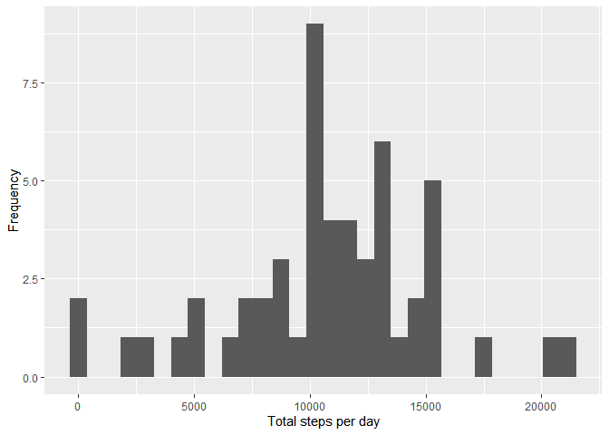
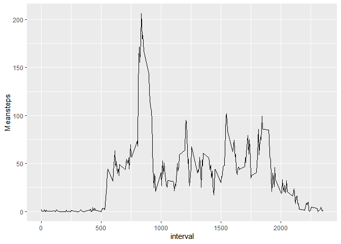
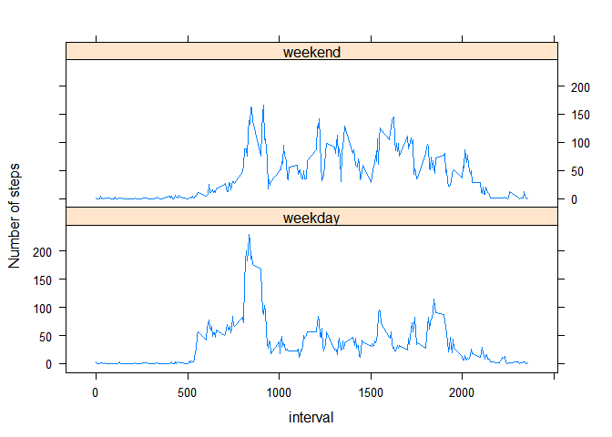

## Loading and preprocessing the data


```r
library(dplyr)
```

```
## 
## Attaching package: 'dplyr'
```

```
## The following objects are masked from 'package:stats':
## 
##     filter, lag
```

```
## The following objects are masked from 'package:base':
## 
##     intersect, setdiff, setequal, union
```

```r
unzip("activity.zip")

file <- read.csv("activity.csv")

file2 <- file

file2 <-  mutate(file2, date = as.Date(date, format = "%Y-%m-%d"))
```
## What is mean total number of steps taken per day?

```r
library(ggplot2)
  
toplot <-   file2 %>%
              group_by(date)%>%
                summarise(Totalsteps = sum(steps))

qplot(Totalsteps, data= toplot, xlab = "Total steps per day", ylab = "Frequency")
```

```
## `stat_bin()` using `bins = 30`. Pick better value with `binwidth`.
```

```
## Warning: Removed 8 rows containing non-finite values (stat_bin).
```

<!-- -->

```r
meanTotal <- mean(toplot$Totalsteps, na.rm = TRUE)

  sprintf("Mean of total steps taken each day are %g",meanTotal)
```

```
## [1] "Mean of total steps taken each day are 10766.2"
```

```r
medianTotal <- median(toplot$Totalsteps, na.rm = TRUE)

 sprintf("Median of total steps taken each day are %g",medianTotal)
```

```
## [1] "Median of total steps taken each day are 10765"
```
## What is the average daily activity pattern?


```r
intervalplot <- file2 %>%
                   group_by(interval) %>%
                      summarise(Meansteps = mean(steps, na.rm = TRUE))

ggplot(data = intervalplot, aes(interval, Meansteps)) + geom_line()
```

<!-- -->

```r
maxinterval <- intervalplot %>%
                        select(interval, Meansteps) %>%
                            filter(Meansteps == max(Meansteps, na.rm =TRUE))

sprintf("Maximum number of steps are from the interval %g",maxinterval$interval)
```

```
## [1] "Maximum number of steps are from the interval 835"
```

## Imputing missing values


```r
## Check in which columns we have NAs

##any(is.na(file2$steps))
##any(is.na(file2$date))
##any(is.na(file2$interval))

## Count NAs

nadata <- file2[!complete.cases(file2),]

rowna <- nrow(nadata)

sprintf("Number of NAs in the data set are %g", rowna)
```

```
## [1] "Number of NAs in the data set are 2304"
```

```r
## Imput missing data

meanday <-  file2 %>%
              group_by(date)%>%
                summarise(avgsteps = mean(steps,na.rm =TRUE))

meaninterval <- file2 %>%
                  group_by(interval)%>%
                      summarise(avgsteps = mean(steps,na.rm =TRUE))


file3 <- merge(file2,meaninterval, by = "interval", all.x = TRUE )

file3$steps <- ifelse(is.na(file3$steps),file3$avgsteps,file3$steps)

data1 <- select(file3, interval, steps,date)

## Check if still NAs: any(is.na(data1$steps))

finaldata <- data1 %>%
              group_by(date)%>%
                summarise(Totalsteps = sum(steps))

## Plot Histogram

qplot(Totalsteps, data= toplot, xlab = "Total steps per day", ylab = "Frequency")
```

```
## `stat_bin()` using `bins = 30`. Pick better value with `binwidth`.
```

```
## Warning: Removed 8 rows containing non-finite values (stat_bin).
```

<!-- -->

```r
## Calculate mean and median

finalmean <- mean(finaldata$Totalsteps)

finalmedian <- median(finaldata$Totalsteps)

sprintf("Mean of total steps taken each day with new data are %g",finalmean)
```

```
## [1] "Mean of total steps taken each day with new data are 10766.2"
```

```r
sprintf("Median of total steps taken each day with new data are %g",finalmedian)
```

```
## [1] "Median of total steps taken each day with new data are 10766.2"
```

## Are there differences in activity patterns between weekdays and weekends?


```r
library(lattice)

## Weekdays are in Spanish ("sábado and doming are the weekend")

wdata <- mutate(data1, weekday = weekdays(data1$date))

wdata$wday_wend <- ifelse(wdata$weekday == "sábado" | wdata$weekday == "domingo", "weekend","weekday")

wdata$wday_wend <- factor(wdata$wday_wend)


meanwdata <- wdata %>%
                  group_by(wday_wend,interval) %>%
                      summarise(meandata = mean(steps))


xyplot(meandata~interval|wday_wend, data = meanwdata, layout= c(1,2), ylab = "Number of steps", type= "l")
```

<!-- -->


